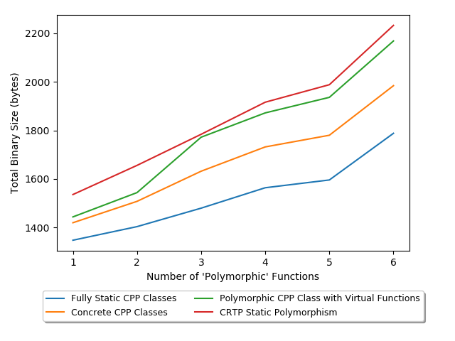

# C++ OO Method's Code Size Comparison

Compares the resulting code size for a simple UART driver and buffer utility development using four different C++ 'object orientated' methods:
- Using pure static classes.
- Using concrete classes.
- Using polymorphic 'interface' classes
- Using static polymorphism with CRTP.

Each branch contains the incremental driver development. The goal of this codebase is solely to determine the code size overhead of implementing dependency injection to support test driven development. The run-time effect of polymorphism is not taken into account.

A general look at difference between the assembly generated by each method can be found at [godbolt](https://gcc.godbolt.orghttps://gcc.godbolt.org/z/eKaxEn/z/eKaxEn).

## Overall Code Size

The code size of the driver and utility was calculated using the 'dec' column output of `arm-none-eabi-size` on the .elf of the binary for each additional function added to the program. An overall analysis of the code size is:

  

## Incremental Code Size

### One Polymorphic Function (Branch: oneFunction)

Program Type                             | Text | Data | BSS | Total | Relative Size
|:---------------------------------------|-----:|-----:|----:|------:|-------------:|
Empty CPP Program                        | 864  | 8    | 32  | 904   | NA
UART Driver as fully static CPP classes  | 1308 | 8    | 32  | 1348  | 100.00 %
UART Driver as only concrete CPP classes | 1380 | 8    | 32  | 1420  | 105.34 %
UART Driver as polymorphic CPP class     | 1404 | 8    | 32  | 1444  | 107.12 %
UART Driver as CRTP CPP class            | 1496 | 8    | 32  | 1536  | 113.94 %

### Two Polymorphic Functions (Branch: twoFunctions)

Program Type                             | Text | Data | BSS | Total | Relative Size
|:---------------------------------------|-----:|-----:|----:|------:|-------------:|
Empty CPP Program                        | 864  | 8    | 32  | 904   | NA
UART Driver as fully static CPP classes  | 1364 | 8    | 32  | 1404  | 100.00 %
UART Driver as only concrete CPP classes | 1468 | 8    | 32  | 1508  | 107.40 %
UART Driver as polymorphic CPP class     | 1504 | 8    | 32  | 1544  | 109.97 %
UART Driver as CRTP CPP class            | 1616 | 8    | 32  | 1656  | 117.94 %

### Three Polymorphic Functions (Branch: threeFunctions)

Program Type                             | Text | Data | BSS | Total | Relative Size
|:---------------------------------------|-----:|-----:|----:|------:|-------------:|
Empty CPP Program                        | 864  | 8    | 32  | 904   | NA
UART Driver as fully static CPP classes  | 1440 | 8    | 32  | 1480  | 100.00 %
UART Driver as only concrete CPP classes | 1592 | 8    | 32  | 1632  | 110.27 %
UART Driver as polymorphic CPP class     | 1732 | 8    | 32  | 1772  | 119.72 %
UART Driver as CRTP CPP class            | 1744 | 8    | 32  | 1784  | 120.54 %

### Four Polymorphic Functions (Branch: fourFunctions)

Program Type                             | Text | Data | BSS | Total | Relative Size
|:---------------------------------------|-----:|-----:|----:|------:|-------------:|
Empty CPP Program                        | 864  | 8    | 32  | 904   | NA
UART Driver as fully static CPP classes  | 1516 | 8    | 40  | 1564  | 100.00 %
UART Driver as only concrete CPP classes | 1692 | 8    | 32  | 1732  | 110.74 %
UART Driver as polymorphic CPP class     | 1832 | 8    | 32  | 1872  | 119.69 %
UART Driver as CRTP CPP class            | 1876 | 8    | 32  | 1916  | 122.50 %

### Five Polymorphic Functions (Branch: fiveFunctions)

Program Type                             | Text | Data | BSS | Total | Relative Size
|:---------------------------------------|-----:|-----:|----:|------:|-------------:|
Empty CPP Program                        | 864  | 8    | 32  | 904   | NA
UART Driver as fully static CPP classes  | 1548 | 8    | 40  | 1596  | 100.00 %
UART Driver as only concrete CPP classes | 1740 | 8    | 32  | 1780  | 111.52 %
UART Driver as polymorphic CPP class     | 1896 | 8    | 32  | 1936  | 121.30 %
UART Driver as CRTP CPP class            | 1948 | 8    | 32  | 1988  | 124.56 %

### Six Polymorphic Functions (Branch: sixFunctions)

Program Type                             | Text | Data | BSS | Total | Relative Size
|:---------------------------------------|-----:|-----:|----:|------:|-------------:|
Empty CPP Program                        | 864  | 8    | 32  | 904   | NA
UART Driver as fully static CPP classes  | 1740 | 8    | 40  | 1788  | 100.00 %
UART Driver as only concrete CPP classes | 1944 | 8    | 32  | 1984  | 110.96 %
UART Driver as polymorphic CPP class     | 2128 | 8    | 32  | 2168  | 121.25 %
UART Driver as CRTP CPP class            | 2192 | 8    | 32  | 2232  | 124.83 %

## Running the Examples

1. Clone the repository.
2. Switch the master branch.
3. Run `make analyse` to build all examples, display the code size for each step and generate a graphical output.

